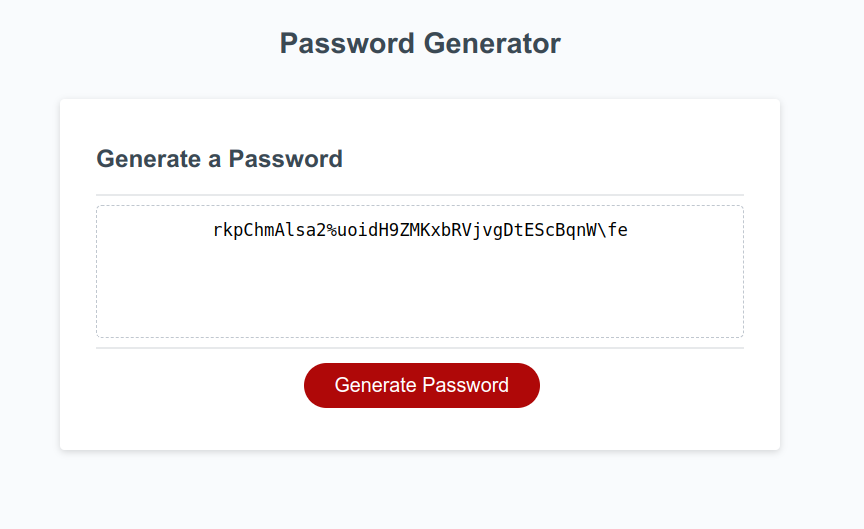
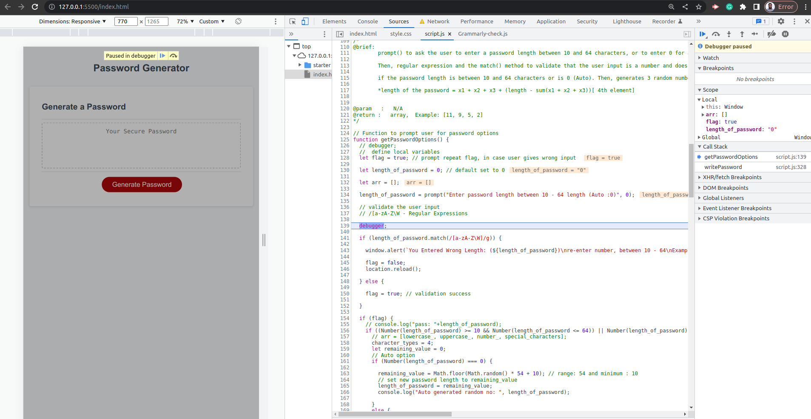

# Password-Generator

## Description 

Link to project : [Password Generator](https://niwantha33.github.io/Password-Generator/)




When a user clicks on the button with the id "generate", 
```html
<button id="generate" class="btn">Generate Password</button>
```
----

```JavaScript

// Get references to the #generate element
var generateBtn = document.querySelector('#generate');

// Add event listener to generate button
generateBtn.addEventListener('click', writePassword);
```
it triggers the writePassword() function which will execute the following steps:

```Javascript
function writePassword() {
  console.time();
  let password_types = getPasswordOptions();
  let password_array = getRandom(password_types);
  var password = generatePassword(password_array);

  var passwordText = document.querySelector('#password');

  passwordText.value = password;
  console.timeEnd();

}
```


- It calls the getPasswordOptions() function which prompts the user to enter the desired length of their          password   and returns an array of numbers representing the number of characters for each type of characters.

-   It calls the getRandom(password_types) function which takes in password_types array and returns an array of randomly selected characters based on the number of characters for each type of characters.

-   It calls the generatePassword(password_array) function which takes in the password_array of randomly selected characters, shuffles them and join them back to a string and returns the generated password.

-   It assigns the generated password to the value of the element with the id "password",

```html
<textarea
            readonly
            id="password"
            placeholder="Your Secure Password"
            aria-label="Generated Password"
          ></textarea>
```
----

```JavaScript
  var passwordText = document.querySelector('#password');

  passwordText.value = password;
```
- I used regular expressions to validate the user input for the password characters. Initially, I used isFinite() function in my program to check non-numeric characters. 

- Furthermore, I figured out there is a method called regular expression pattern sequence. So, that could help to find the incorrect user inputs. 

- Further, I found two inbuilt libraries in JavaScript called "match" and "test". 

```javascript

  if (length_of_password.match(/[a-zA-Z\W]/g)) {

    window.alert(`You Entered Wrong Length: (${length_of_password})\nre-enter number, between 10 - 64\nExample : 12 `);

    flag = false;
    location.reload();

  } else {

    flag = true; // validation success 

  }

  ```


- Here I used the regular expression to match any non-numeric input and pass to the if condition to raise the flag. If the flag status is 1 (true), it will convert the user string to value using the "Number" function.

```JavaScript
(Number(length_of_password) >= 10 && Number(length_of_password <= 64)) || Number(length_of_password) === 0)
```

- If the user input is between 10 to 64, then it will generate a random number array for each character type. 

- I used combination of methods to ensure the generated password is complex and difficult to guess.

## Debugger

- I learned the "debugger statement" which helps to inspect the variables in my source code and helped me to find the issues in my code. 

```JavaScript
  debugger;
```




## Credits 
[ECMA262 Specifications](https://tc39.es/ecma262/multipage/numbers-and-dates.html#sec-math.random) : Math.floor()function & Math.random()

[sorting an array](https://developer.mozilla.org/en-US/docs/Web/JavaScript/Reference/Global_Objects/Array/sort) sorting and comparing numbers

[reduce() method](https://developer.mozilla.org/en-US/docs/Web/JavaScript/Reference/Global_Objects/Array/reduce) adding array elements and return the total of elements -  reduce()

[Array.from method](https://developer.mozilla.org/en-US/docs/Web/JavaScript/Reference/Global_Objects/Array/from#specifications)

[Regular Expressions](https://www.youtube.com/watch?v=ZfQFUJhPqMM) : Learn Regular Expressions (Regex) 